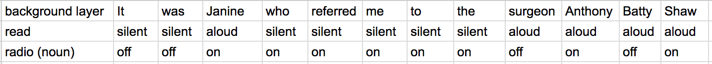

# ghostses
*a duo*

each performer reads and has a batterie of instruments including: an assortment of tuning forks (random pitches), an am/fm radio, a harmonica, a kitchen timer, and a variety of little percussion instruments (rocks - toys).

a text is selected to act as the corpus. the text may be an excerpt of something by W.G. Sebald or  something that deals with similar themes. the corpus defines the total possible text to be used in the performance. initial performances of this piece used Chapter 1 from the Rings of Saturn.

the corpus is divided into multiple files (each a separate layer) via a Python program (available upon request). the program outputs one layer containing all text (the background layer) and numerous foreground layers containing filtered, colored portions of the text (currently organized into parts of speech) printed on transparencies in their original location. performers assign a category from their batterie to each foreground layer (nouns refer to radio, verbs to tuning forks, etc.).

sections are created by stacking two or more foreground layers on top of a background layer (all from the same page). progression through each section is dictated by each performer's silent reading of the background text (normal reading rate, not/loosely coordinated). performers execute the assigned category of actions when they arrive at a word on the background sheet that intersects with that same word on a foreground sheet, simultaneously reading that word aloud and up to one or two words directly proceeding and/or following (or both proceeding and following).

actions are dictated by pairs of words on the same foreground sheet. For example:

in the example above the first noun (Janine) indicates the start of radio action which may continue until a second noun (surgeon), the utterance of which demarcates an end to radio action.

performers are encouraged to change the number and selection of foreground layers for each section.

a loosely coordinated distortion.

symbols/percussion - > do not read aloud

each page is almost like a movement, opportunity to reset
pages are read top to bottom, left to right, however sequences of pages may be in any order

symmetries...there is a small window where subtle/natural differences are held closely together...produces fuzziness

radios -> change station after each off

tuning forks need resonators

complications
(forthcoming)

if synchronicity of X:
    loop
